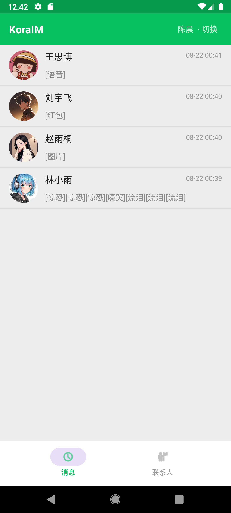
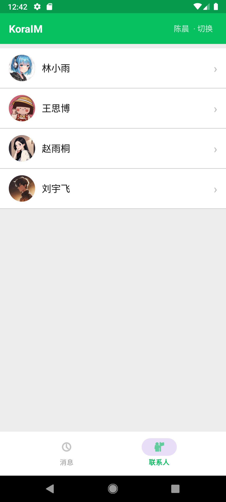
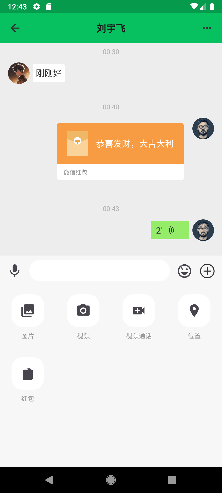
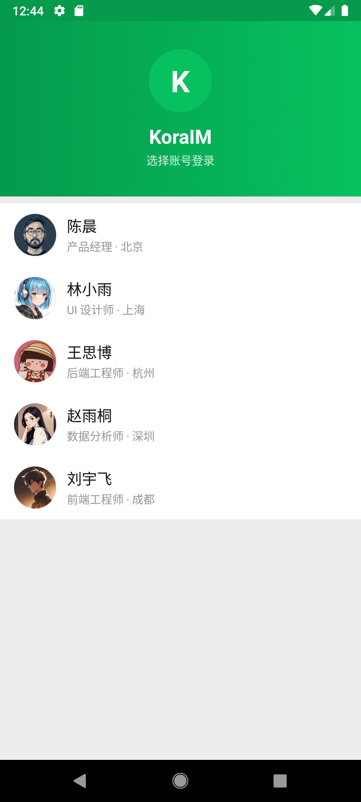

# KoraIM

[](LICENSE)
[](https://developer.android.com)
[](https://kotlinlang.org)

**KoraIM** 是由 **GodCodeApps** 开源的轻量级、高性能、易扩展的 Android 即时通讯（IM）SDK 框架。架构设计上实现了 **通信内核（imcore）** 与 **UI 组件（imui）** 的彻底解耦，帮助 Android 开发者在 **5 分钟内快速搭建具备微信级交互体验的聊天系统**。

---

## 📸 效果预览

<div align="center">
  
  
  <br/>
  
  
</div>

---

## 🌟 核心特性

- 🚀 **极简集成**：只需设置账号与初始化两步，即可拥有完整的收发消息、离线存储、会话管理与全套 UI。
- 💬 **微信级交互体验**：
  - **无缝软键盘/面板切换**：动态记忆真实软键盘高度，杜绝切换表情/更多面板时的闪烁跳动与多层堆叠。
  - **录音 HUD 实时波形**：按住说话弹出半透明 HUD，支持 6 级麦克风实时音量跳动波形与上滑取消视觉反馈。
  - **富媒体气泡支持**：内置文本、Emoji、图片自适应宽高比、语音动态宽度与播放动画、视频弹窗播放、3D 翻转拆红包、居中提示消息。
  - **网络状态条**：会话列表顶部展示类似微信的网络连接状态栏（连接中/重连中/断开警告），支持一键跳转网络设置。
- 🛡️ **高可靠通信引擎**：
  - **TCP 长连接与应用层心跳保活**：定时保活监测，防止 NAT 超时断连。
  - **智能重连机制**：具备指数退避策略与网络状态变化感知，断网恢复秒级重连。
  - **端到端 ACK 可靠确认**：严格的消息 ID 追踪，发送超时自动标记为失败，支持一键重发。
- 🔄 **全响应式数据流**：基于 SQLite + Kotlin Coroutines & StateFlow/SharedFlow，底层数据变更自动驱动 UI 秒级响应刷新。
- 🧩 **高可扩展 SPI 设计**：多媒体文件上传与自定义消息附件均基于 SPI 抽象，无缝对接任意 OSS/文件服务器，支持无侵入扩展自定义消息卡片。

---

## 📦 模块分层

```
KoraIM
├── imcore        # 【核心通信库】TCP 长连接管理、心跳保活、ACK 确认、SQLite 本地持久化、响应式数据流
├── imui          # 【UI 组件库】微信交互风格输入框、消息气泡列表、录音 HUD、会话列表、开箱即用 Base Fragment
├── app           # 【接入示例 Demo】包含单聊会话、消息列表、多媒体发送的完整实现演示
└── server        # 【本地联调服务】基于 Node.js 实现的轻量 TCP 示例服务端（仅供本地开发联调）
```

---

## 🚀 5 分钟快速接入教程

### 1. 声明权限与 Activity 配置

在你的 `AndroidManifest.xml` 中添加网络与多媒体所需权限，并务必为聊天 Activity 添加 `windowSoftInputMode="adjustResize"`：

```xml
<manifest xmlns:android="http://schemas.android.com/apk/res/android">
    <!-- 基础网络权限 -->
    <uses-permission android:name="android.permission.INTERNET" />
    <uses-permission android:name="android.permission.ACCESS_NETWORK_STATE" />
    
    <!-- 语音与多媒体权限 -->
    <uses-permission android:name="android.permission.RECORD_AUDIO" />
    <uses-permission android:name="android.permission.VIBRATE" />
    <uses-permission android:name="android.permission.READ_MEDIA_IMAGES" />
    <uses-permission android:name="android.permission.READ_MEDIA_VIDEO" />
    <!-- Android 12 及以下读写存储权限 -->
    <uses-permission android:name="android.permission.READ_EXTERNAL_STORAGE" android:maxSdkVersion="32" />
    <uses-permission android:name="android.permission.WRITE_EXTERNAL_STORAGE" android:maxSdkVersion="28" />

    <application ...>
        <!-- 聊天页面配置 adjustResize 确保键盘与输入面板无缝切换 -->
        <activity
            android:name=".chat.ChatActivity"
            android:windowSoftInputMode="adjustResize" />
    </application>
</manifest>
```

### 2. 初始化 SDK 与配置 Provider

在登录成功或进入主界面时，设置账号并完成 SDK 初始化：

```kotlin
// 1. 设置当前登录账号（必须在 IMClient.init 之前调用）
ImSdkImpl.setAccount(currentAccount)

// 2. 初始化 IM 核心引擎 (配置服务器 IP 和端口)
IMClient.init(applicationContext, host = "192.168.1.9", port = 8090)

// 3. 配置多媒体文件上传 Provider (图片、语音、视频上传)
ImUIKitImpl.setMediaMessageProvider(object : IMMediaMessageProvider {
    override suspend fun uploadImage(request: ImageUploadRequest): ImageUploadResult {
        val remoteUrl = uploadToOss(request.localPath)
        return ImageUploadResult(remoteUrl)
    }

    override suspend fun uploadVideo(request: VideoUploadRequest): VideoUploadResult {
        val videoUrl = uploadToOss(request.localVideoPath)
        val coverUrl = uploadToOss(request.localCoverPath)
        return VideoUploadResult(videoUrl, coverUrl)
    }

    override suspend fun uploadVoice(request: VoiceUploadRequest): VoiceUploadResult {
        val voiceUrl = uploadToOss(request.localPath)
        return VoiceUploadResult(voiceUrl)
    }
})

// 4. 配置用户信息 Provider (头像、昵称提供器)
IMClient.userInfoProvider = object : IMUserInfoProvider {
    override fun getUserInfo(account: String): UserInfo? {
        return findLocalUser(account) // 从本地缓存/数据库同步获取
    }

    override fun fetchUserInfoFromServer(account: String, callback: (UserInfo?) -> Unit) {
        fetchRemoteUser(account) { callback(it) } // 异步从业务服务器拉取
    }
}

// 5. 配置会话全局事件监听（头像点击、失败重发等）
ImUIKitImpl.setSessionEventListener(SessionEventListener().apply {
    onAvatarClickListener { view, account: String? ->
        Toast.makeText(context, "点击了用户头像: $account", Toast.LENGTH_SHORT).show()
    }
    onResendClickListener { view, message: IMMessage? ->
        (message as? Message)?.let {
            lifecycleScope.launch {
                if (IMMediaMessageSender.isMedia(it)) {
                    IMMediaMessageSender.send(it)
                } else {
                    it.status = MsgStatus.SENDING
                    IMClient.sendMessage(it)
                }
            }
        }
    }
})
```

### 3. 会话列表接入 (`IConversationListFragment`)

继承 `IConversationListFragment`，只需重写点击事件路由：

```kotlin
class MessageFragment : IConversationListFragment() {

    override fun onConversationClick(conversation: Conversation) {
        val intent = Intent(activity, ChatActivity::class.java).apply {
            putExtra("session_type", conversation.sessionType)
            putExtra("session_id", conversation.sessionId)
            putExtra("peer_id", conversation.peerId)
        }
        startActivity(intent)
    }
}
```

### 4. 聊天页面接入 (`IMessageFragment`)

在 `ChatActivity` 中挂载继承自 `IMessageFragment` 的 Fragment：

```kotlin
// 1. 定义聊天 Fragment
class P2PChatFragment : IMessageFragment()

// 2. 在 ChatActivity 中传递参数启动
class ChatActivity : AppCompatActivity() {
    override fun onCreate(savedInstanceState: Bundle?) {
        super.onCreate(savedInstanceState)
        setContentView(R.layout.activity_chat)

        val fragment = P2PChatFragment().apply {
            arguments = Bundle().apply {
                putInt("session_type", intent.getIntExtra("session_type", SessionType.P2P))
                putString("session_id", intent.getStringExtra("session_id"))
                putString("peer_id", intent.getStringExtra("peer_id"))
            }
        }
        supportFragmentManager.beginTransaction()
            .replace(R.id.fragment_container, fragment)
            .commit()
    }
}
```

---

## 📖 核心 API 说明

### 1. 通信与连接控制 (`IMClient` / `ImSdkImpl`)

| API / 属性 | 作用说明 |
|:---|:---|
| `ImSdkImpl.setAccount(account)` | 设置当前登录账号（**必须在 `IMClient.init` 之前调用**） |
| `ImSdkImpl.getAccount()` | 获取当前登录账号 |
| `IMClient.init(context, host, port)` | 初始化 SDK（创建 SQLite 数据库、建立 TCP 长连接、恢复增量同步游标） |
| `IMClient.release()` | 断开长连接、清除缓存、释放协程与网络资源（退出登录或切换账号时调用） |
| `IMClient.userInfoProvider` | 获取/设置 `IMUserInfoProvider`（头像与昵称数据源） |
| `IMClient.connectionState` | `StateFlow<ConnectionState>` 实时监听网络连接状态（`Connected`, `Connecting`, `Reconnecting`, `Disconnected`, `Failed`） |

### 2. 消息操作与响应式监听 (`IMClient`)

| API 方法 | 作用说明 |
|:---|:---|
| `IMClient.incomingMessages` | `SharedFlow<Message>` 实时监听接收到的新消息 |
| `IMClient.messageUpdates` | `SharedFlow<Message>` 实时监听消息状态变更（`SENDING` / `SUCCESS` / `FAIL`） |
| `IMClient.sendMessage(message)` | 发送消息（自动入库、状态置为 `SENDING`，通过 TCP 发送并等待 ACK，超时自动标记失败） |
| `IMClient.saveMessage(message)` | 保存/更新单条消息到本地 SQLite（不触发网络发送） |
| `IMClient.saveMessages(messages)` | 批量保存消息到本地 SQLite |
| `IMClient.getMessageById(messageId)` | 根据消息 ID 查询单条消息实体 |
| `IMClient.getMessagePage(sessionId, page)` | 分页查询指定会话的历史消息记录 |
| `IMClient.observeMessages(sessionId)` | `Flow<List<Message>>` 响应式监听指定会话的消息列表（用于聊天页自动刷新） |
| `IMClient.observeP2PMessages(peerId)` | `Flow<List<Message>>` 响应式监听与指定用户的点对点消息 Flow |
| `IMClient.observeLastMessage(sessionId)` | `Flow<Message>` 响应式监听指定会话的最新一条消息 |

### 3. 会话与未读数统计 (`IMClient`)

| API 方法 | 作用说明 |
|:---|:---|
| `IMClient.getConversations()` | 异步获取当前账号的所有会话列表 |
| `IMClient.getP2PConversation(peerId)` | 异步获取与指定用户的 P2P 会话实体 |
| `IMClient.observeConversations()` | `Flow<List<Conversation>>` 响应式监听会话列表（按时间降序实时更新） |
| `IMClient.observeTotalUnreadCount()` | `Flow<Int>` 响应式监听全局总未读数（用于 App 底部 Tab 栏红点角标） |
| `IMClient.addUnreadCountListener(listener)` | Java 友好的未读数监听器，返回 `UnreadCountSubscription`（可调用 `cancel()` 取消） |
| `IMClient.markConversationRead(sessionId)` | 标记某个会话的消息为已读，清除未读角标 |
| `IMClient.getUserInfo(account)` | 综合查询用户信息（内存缓存 → SQLite 本地库 → `userInfoProvider` 远程拉取） |

### 4. 快捷消息工厂 (`MessageBuilder`)

`MessageBuilder` 提供便捷的方法构造各类标准消息实体：
- `MessageBuilder.createTextMessage(sessionId, sessionType, msg = "你好", receiverId = ...)`
- `MessageBuilder.createImageMessage(sessionId, sessionType, localPath = "...", mWidth = 1080, mHeight = 1920, size = 102400, mimeType = "image/jpeg")`
- `MessageBuilder.createVideoMessage(sessionId, sessionType, receiverId, attachment)`
- `MessageBuilder.createRedPacketMessage(sessionId, sessionType, receiverId, attachment)`
- `MessageBuilder.createTipMessage(sessionId, sessionType, receiverId, msg = "提示文本")`

### 5. 多媒体异步发送 (`IMMediaMessageSender`)

- `IMMediaMessageSender.send(message)`: 协程挂起上传多媒体附件并调用 `IMClient.sendMessage`
- `IMMediaMessageSender.enqueue(message)`: 推入后台全局队列执行上传并发送（页面销毁不受影响）
- `IMMediaMessageSender.isMedia(message)`: 判断消息是否为图片/视频/语音等多媒体类型

---

## 🎨 扩展自定义业务消息气泡 (SPI 机制)

如果需要扩展例如“商品卡片”、“优惠券”等自定义消息类型，SDK 提供了基于 Java SPI 与气泡工厂的完全解耦扩展方案：

### 第 1 步：定义自定义 Attachment 实体
实现 `MsgAttachment` 接口，必须提供带有 `json: String` 入参的构造函数供底层反序列化调用：

```kotlin
data class GoodsAttachment(
    var goodsId: String = "",
    var goodsName: String = "",
    var price: String = "",
    var imageUrl: String = ""
) : MsgAttachment {

    constructor(json: String) : this() {
        runCatching {
            val obj = org.json.JSONObject(json)
            goodsId = obj.optString("goodsId")
            goodsName = obj.optString("goodsName")
            price = obj.optString("price")
            imageUrl = obj.optString("imageUrl")
        }
    }

    override fun toJson(send: Boolean): String = org.json.JSONObject().apply {
        put("goodsId", goodsId)
        put("goodsName", goodsName)
        put("price", price)
        put("imageUrl", imageUrl)
    }.toString()

    override fun getMsgType(): Int = 1001 // 自定义消息 Type (> 1000)
}
```

### 第 2 步：配置 SPI 服务发现（必须）
为了让 `imcore` 内核在收到消息或从数据库读取时能够自动将 JSON 反序列化为 `GoodsAttachment`，需要在你的模块 `src/main/resources/META-INF/services/` 目录下创建或编辑文件：

**文件路径**：`src/main/resources/META-INF/services/com.kora.imcore.attachment.MsgAttachment`  
**文件内容**（添加你的 Attachment 全类名）：
```text
com.yourpkg.GoodsAttachment
```

> **原理说明**：`imcore` 初始化时会通过 `ServiceLoader.load(MsgAttachment::class.java)` 扫描并注册所有附件解析器，调用 `message.getAttachment()` 时即会自动识别并匹配对应类型。

### 第 3 步：编写自定义气泡 ViewHolder
继承 `MsgViewHolderBase` 实现布局加载与数据绑定：

```kotlin
class MsgGoodsViewHolder(itemView: View) : MsgViewHolderBase(itemView) {
    override fun getLayout(): Int = R.layout.item_msg_goods_card

    override fun bindViewHolder(view: View, message: IMMessage) {
        val goods = MsgViewHolderFactory.getAttachment(message) as? GoodsAttachment ?: return
        view.findViewById<TextView>(R.id.tv_goods_name).text = goods.goodsName
        view.findViewById<TextView>(R.id.tv_goods_price).text = "¥${goods.price}"
        Glide.with(view).load(goods.imageUrl).into(view.findViewById(R.id.iv_goods_pic))
    }
}
```

### 第 4 步：注册到气泡工厂
在 Application 或聊天页面初始化时注册映射关系：

```kotlin
MsgViewHolderFactory.register(GoodsAttachment::class.java, MsgGoodsViewHolder::class.java)
```

---

## 🛠️ 本地联调服务端

工程自带了一个用于本地联调的 Node.js TCP 演示服务端：

```bash
# 进入服务端目录
cd server

# 启动本地 TCP 消息中继服务 (默认监听 8090 端口)
npm start
```

---

## 📄 开源许可证

KoraIM 基于 **[Apache License 2.0](LICENSE)** 协议开源。欢迎提交 Issue 与 Pull Request！

Copyright 2026 GodCodeApps
